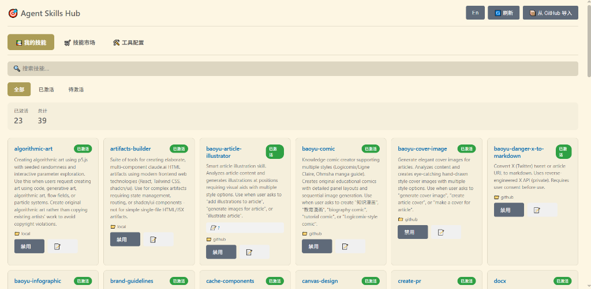
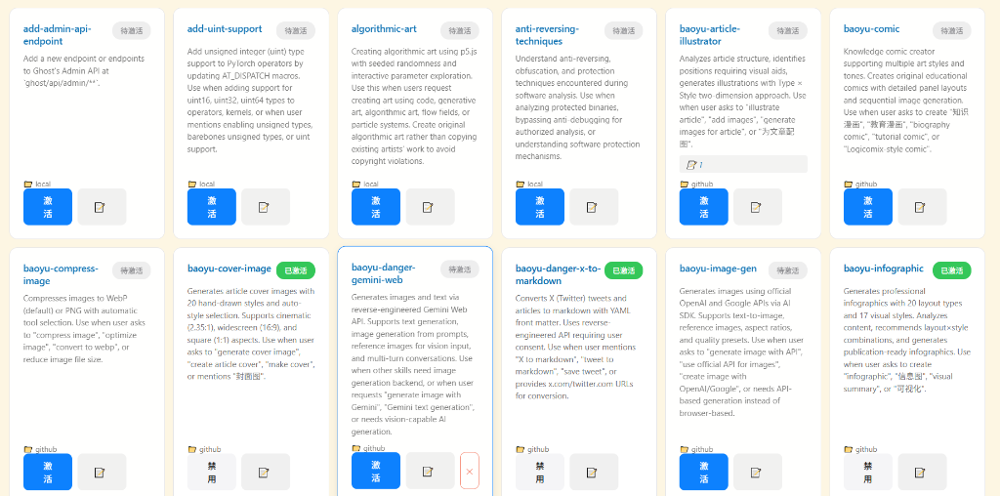
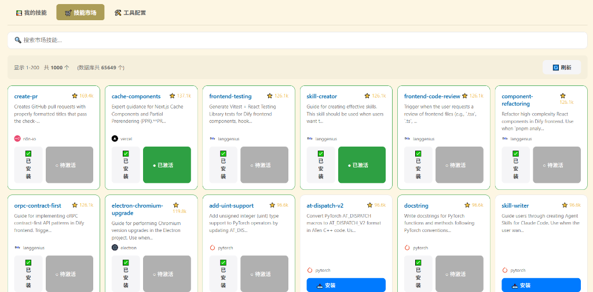
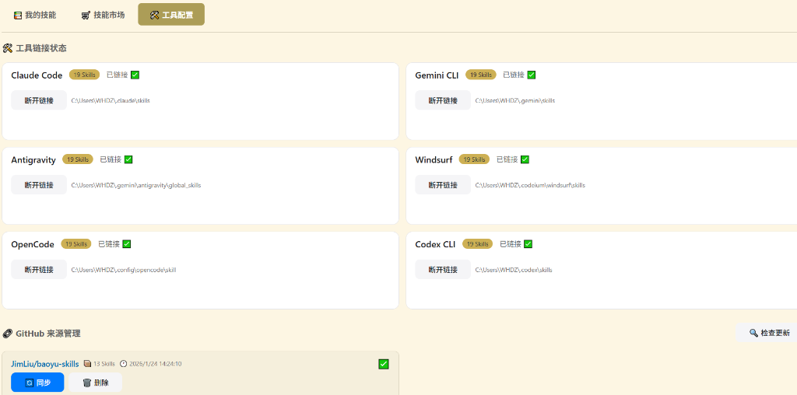

# 🎯 Agent Skills Hub

<p align="center">
  
</p>

<p align="center">
  <strong>集中管理 AI Agent Skills 的优雅解决方案</strong>
</p>

<p align="center">
  
  
  
  
</p>

---

**Agent Skills Hub** 是一个采用 **苹果设计风格** 的 VS Code 扩展,用于集中管理多个 AI Agent 工具的 Skills。通过统一的中央仓库,轻松实现 Skills 的跨工具共享、版本同步和一键激活。

### 🎨 设计亮点

- ✨ **苹果设计语言** - 圆润卡片、系统配色、流畅动画
- 💎 **精致 UI** - 12px 圆角、渐变透明、优雅过渡效果
- 🎯 **清晰层次** - iOS 风格图标、彩色状态徽章、大数字统计

## ✨ 核心特性

### 🎨 视觉与交互

- 💫 **苹果风格 UI** - 采用 iOS 设计语言,圆润卡片、系统配色
- ✨ **流畅动画** - 300ms 淡入淡出、悬停浮动窗口效果
- 📊 **数据可视化** - 大数字统计、趋势指示、彩色图标

### 🛠️ 功能特性

- 🏠 **中央仓库** - 所有 Skills 统一存储在 `~/.agent/skills`
- 🔗 **多工具支持** - 支持 Claude Code、Gemini CLI、Antigravity、Windsurf、OpenCode、Codex CLI
- 🛒 **技能市场** - 浏览 65,000+ 开源 Skills,一键安装
- 🌐 **国际化** - 支持中英文界面无缝切换
- 🔍 **智能搜索** - 支持多关键词 AND 匹配与优先级排序
- 🔄 **联动过滤** - 搜索与分类筛选（已激活/待激活）完美联动
- 📦 **GitHub 导入** - 直接从 GitHub 仓库导入 Skills
- 📝 **备注系统** - 为每个 Skill 添加个性化备注

## 📸 界面预览

### 我的技能 - 已激活

管理所有已安装的 Skills，支持启用/禁用、删除等操作。

<p align="center">
  
</p>

### 我的技能 - 待激活

查看等待激活的 Skills，一键激活后即可使用。

<p align="center">
  
</p>

### 技能市场

浏览来自 [Anthropic Skills Registry](https://github.com/anthropics/anthropic-cookbook) 的海量 Skills。

<p align="center">
  
</p>

### 工具配置

管理各 AI 工具的链接状态和 GitHub 来源。

<p align="center">
  
</p>

## 🔧 支持的工具

| 工具 | Skills 路径 | 状态 |
|------|-------------|------|
| Claude Code | `~/.claude/skills` | ✅ 支持 |
| Gemini CLI | `~/.gemini/skills` | ✅ 支持 |
| Antigravity | `~/.gemini/antigravity/global_skills` | ✅ 支持 |
| Windsurf | `~/.codeium/windsurf/skills` | ✅ 支持 |
| OpenCode | `~/.config/opencode/skill` | ✅ 支持 |
| Codex CLI | `~/.codex/skills` | ✅ 支持 |

## 🚀 快速开始

### 安装

1. 克隆此仓库：

   ```bash
   git clone https://github.com/llsenyue/agent-skills-hub.git
   cd agent-skills-hub
   ```

2. 安装依赖：

   ```bash
   npm install
   ```

3. 编译：

   ```bash
   npm run compile
   ```

4. 在 VS Code 中按 `F5` 启动调试

### 使用

1. 点击侧边栏的 **Agent Skills Hub** 图标 🚀
   - 扩展会自动为您打开全功能的管理面板
   - 如果未自动打开，可以点击侧边栏中的"打开管理面板"按钮
2. 或者使用命令面板 (`Ctrl+Shift+P`) 搜索 "Skill Manager: 打开管理面板"
3. 开始管理你的 Skills！

## 📋 命令列表

| 命令 | 说明 |
|------|------|
| `Skill Manager: 打开管理面板` | 打开主界面 |
| `Skill Manager: 初始化中央仓库` | 创建 `~/.agent/skills` 目录 |
| `Skill Manager: 链接所有工具` | 一键链接所有支持的工具 |
| `Skill Manager: 链接指定工具` | 选择单个工具进行链接 |
| `Skill Manager: 查看链接状态` | 显示各工具的链接状态 |
| `Skill Manager: 创建新 Skill` | 从模板创建 Skill 文件 |

## 🏗️ 项目结构

```
agent-skills-hub/
├── src/
│   ├── extension.ts          # 主入口
│   ├── config/
│   │   └── paths.ts          # 路径配置
│   ├── utils/
│   │   ├── skillSources.ts   # Skills 来源管理
│   │   ├── skillMarketplace.ts # 市场功能
│   │   └── toolPaths.ts      # 工具路径
│   ├── views/
│   │   └── skillsPanel.ts    # 主界面 Webview
│   └── templates/            # Skill 模板
├── docs/
│   └── images/               # 文档图片
├── package.json
└── README.md
```

## 🤝 贡献

欢迎提交 Issue 和 Pull Request！

## 📄 许可证

[MIT License](LICENSE)

---

<p align="center">
  Made with ❤️ for AI Developers
</p>
